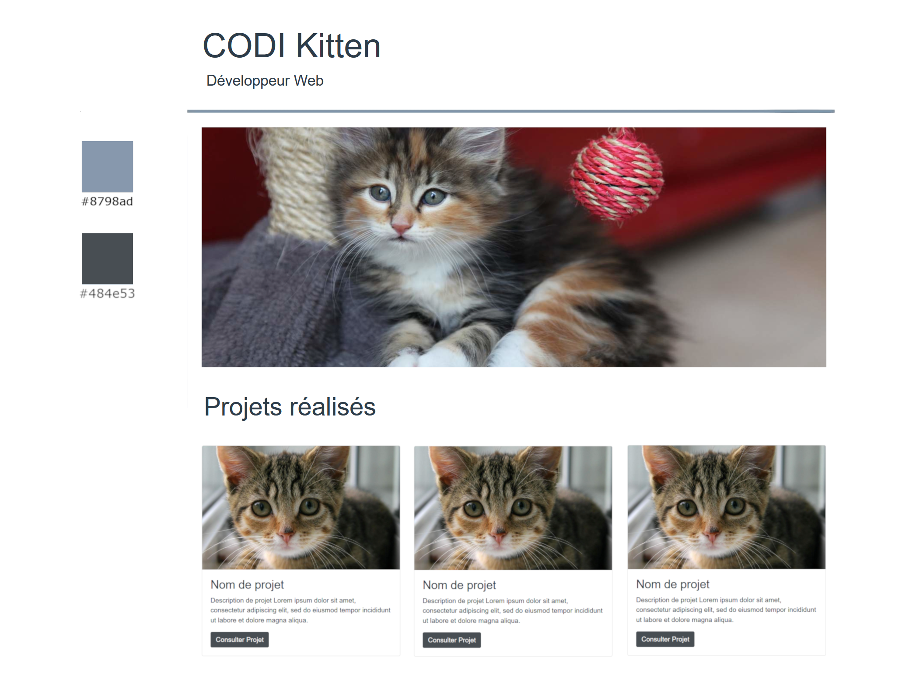

# portfolio.sl
eval simplon compétence 2

Critères d'évaluation
Le Portfolio contient au minimum 4 images, un titre et des paragraphes
Le Portfolio sépare complétement la structure (HTML) du design/style (CSS)
Tous les balises div ont un id ou classe
Le Portfolio utilise le layout flexbox
Le contenu est responsive et s'affiche dans les differentes écrans (Desktop, Tablet, Mobile)
Le code est bien organisé (suivre le guide de style: https://google.github.io/styleguide/htmlcssguide.html)
Améliorations possibles
Utiliser les balises HTML5 comme header, article, section etc.. pour donner de signification au code HTML
Utiliser un framework CSS comme bootstrap
Personnaliser le désign du portfolio hors de la maquette proposée
